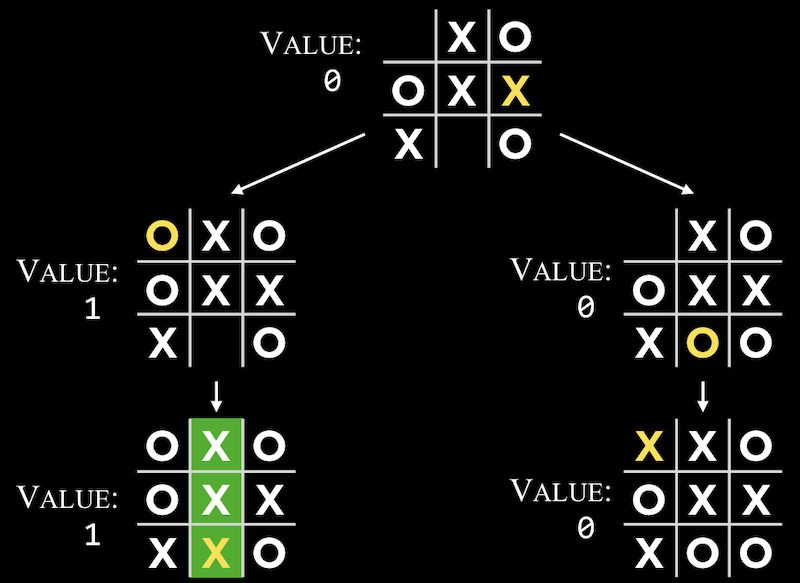
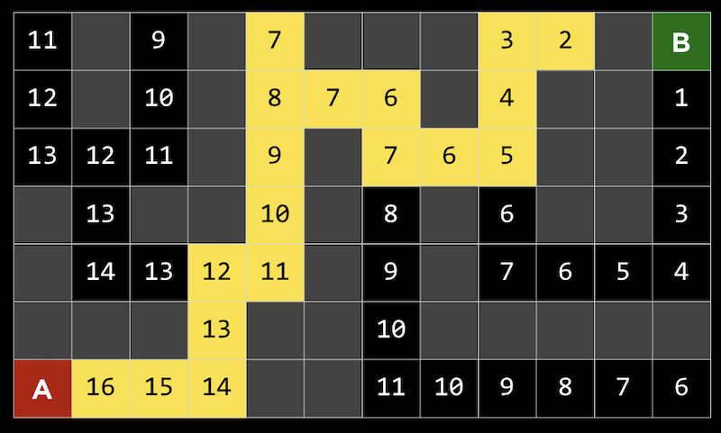
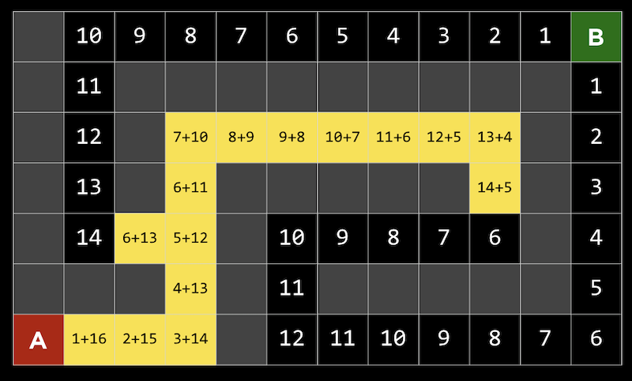

# Artificial Intelligence

[Minimax](#minimax)  
[Search algorithms](#search-algorithms)  
[Genetic algorithms](#genetic-algorithms)  
[Neural networks](#neural-networks)  


## Minmax

Minimax is an algo used to train computers to play games. We start by assigning a value to each possible outcome of the game. So, for example, if the game is tic-tac-toe, we could assign `-1` to `O` winning, `0` to draw, and `1` to `X` winning.

Now each player has a goal. So `X` player will play to maximice the score: `max(X)`, and the `O` player plays to minimize the score: `min(O)`. This means that what's best for `X` is maximizing the score (ie making the outcome of the game 1), and what's best for `O` is minimizing the score (ie making the outcome of the game -1).

We can now traing the computer with every possible tic-tac-toe board and assign a value to it. Every time player `X` wins the board will have a value of 1, every time player `O` wins the board will have a value of -1, and every time there's a draw the board will have a value of 0.

But we can't limit ourselves to only completed boards. So, every boad in which `X` is one move away from winning and it's `X`'s turn to play, will get a value of 1. Likewise, every board in which `O` is one move away from winning and it's `O`'s turn to play, will receive a value of -1.

But these moves are conditional on which players turn it is. So, at each turn, the computer needs to create a decision tree that spans every possible game result, and choose the one that minimizes or maximizes (depending on the player) the game's score.



This can be writen in pseudo-code as

``` txt
if player is X:
  for all possible moves:
    calculate score for board
  choose move with highest score
else:
  for all possible moves:
    calculate score for board
  choose move with lowest score
```

A problem of this algorithm is that at each step each player needs to explore all possible outcomes in order to be able to make a decision. At the start of the game that's 255,168 possible games, and even though they decrease as the game progresses, it's still a lot. This is might not seem like much for tic-tac-toe on a moder computer but, for example, after the first four moves, there are 288 billion possible chess moves. If we consider it from the very start, we don't acctually know the number but some mathematitians have placed the lower bound in 10<sup>29,000</sup>.

**Depth-limited minimax** is a variation of minimax in which we don't follow the game all the way through completion, but instead we consider an *evaluation function* that estimates the expected utility of the game from a given state. The problem now shifts to finding this function and a way of computing it for a number of steps ahead in a game.

## Search algorithms

**minimax** is an example of a search algorithm. In these algos, the goal is to find the next move in a game or solution to some problem. One strategy, **depth-first search**, might be following a possible path, choosing randomly if a choice needs to be made, and going backwards only if there are no more choices possible. One problem with this algorithm is that it takes too long, since it considers all paths in an area before it can go back to the beginning and go in a different direction. Another problem is that the route it finds might not be the most efficient, since the random choices can lead to a longer path.

**Breadth-first search** is an algorithm where we alternate taking each path, one step at a time, like searching outwards from the starting point. This will lead to finding the shortest possible path, but also explore many unnecessary paths.

Both of these algorithms are categorized as **uninformed search**, where the algorithms don’t have additional information about the problem, apart from the very next steps they can make.

In **informed search**, we use knowledge about the problem to find solutions more efficiently with **heuristics**, some way of estimating solutions. One heuristic that we can use is the **Manhattan distance**.

**Greedy best-first** search will, at each fork in the road, pick the path with the best value, which will be the lowest Manhattan distance in this case. Since the distance is easy to compute for any given square, we can label each one:



**A* search**, pronounced “A star search”, uses both the heuristic value of the path, as well as the distance it has already gone for that path. A* search will be optimal if we have an accurate heuristic. Ideally the heuristic is quick to calculate, so the search can be efficient overall.



> In AI, each decision maker is called an agent

## Reinforcement Learning

**Reinforcement Learning** is one type of machine learning. In **Maching Learning** the goal is to allow the computer to learn from experience. Each experience gets a value that tells the computer wheather it was a "good" or "bad" experience so that it can make better decisions the next time. We want ML systems to both *explore*, or try new actions, and *exploit*, or use actions it has done before that are safe.

We can express this in the **Epsilon-Greedy Approach** were we assign a value for the probability of making a random choice (exploring) and a probability of using an exploit

``` txt
epsilon = 0.10
if random() < epsilon:
    make a random move
else:
    make the move with the highest value
```

## Genetic algorithms


## Neutral networks


