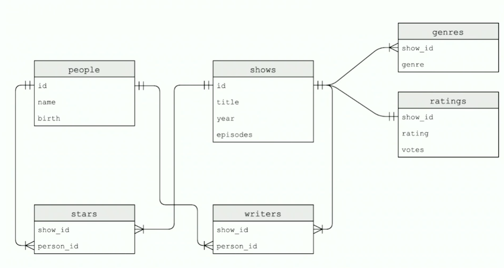

# Week 7 - SQL

`SQLite` uses binary files to represent data in tables. TO interact with the data we'll use a command-line tool called `sqlite3`. Data can be imported by loaded a flat-file database like a `csv`, or we can do it with code. 

To start `sqlite3` in the CS50 IDE we run the `sqlite3` command in the terminal. Then, to import a data set we run:

``` bash
.mode csv
.import FILE_NAME TABLE_NAME
```

Relational data bases suppot 4 operations: **CRUD**

- Create: use keyword `CREATE` or `INSERT`

- Read: use keyword `SELECT`

- Update: use keyword `UPDATE`

- Delete: use keyword `DELETE`

When designing data bases we need to normalize data. To **Normalize** data means to eliminate redundancies.

In SQLite there are five main data types: 1) `BLOB` (**B**inary **L**arge **OB**ject), 2) `INTEGER`, 3) `NUMERIC` (anything that is numeric, but not a counting number...like a year for example), 4) `REAL`, and 5) `TEXT`.

## IMDb


