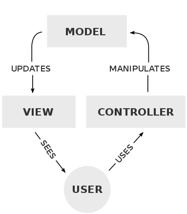

# Week 9 - Flask

We'll use Python's Flask library to do backend (server side) programming. Flask is also a Python framework. One of the things Flask does is URL and request header parsing.

When using the flask framework, we'll organize the files as follows:

- `application.py`: where the code is

- `requirements.txt`: list of requierements (other libs)

- `static/`: static files (CSS, JS, PNGs, GIFs)

- `templates/`: HTML files

Flask uses the following design patter (MVC - Model, View, Controller):



The **controller** is where we write the Python code. It can be multiple files. It's the code that controlls (hence the name) how the application works. The **view** is the UI...all that the user sees. The **Model** the service for the data, for example, SQL DB.

To build a Flask app, just statr with

```python
from flask import Flask, render_template

app = Flask(__name__)

@app.route("/")
def index():
  return render_template("index.html")
```

Here, `app = Flask(__name__)` is just telling Flask to turn this code into a web application. So Flask will start listening on the assigned port. `@app.route("/")` sets the route (the URL). The `@` is just a decorator. To start the server, we run in the command line

``` bash
flask run
```

