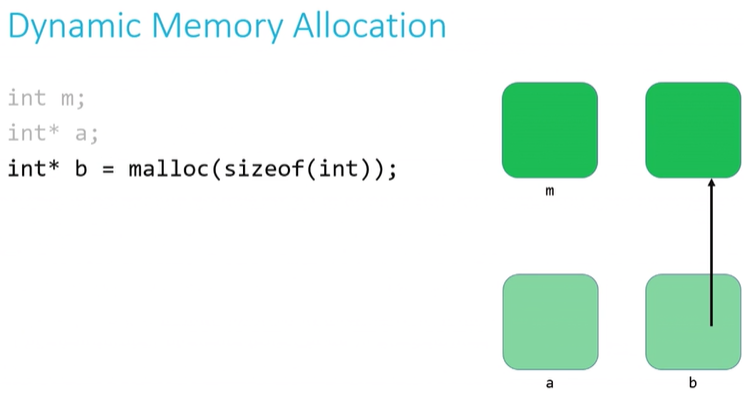
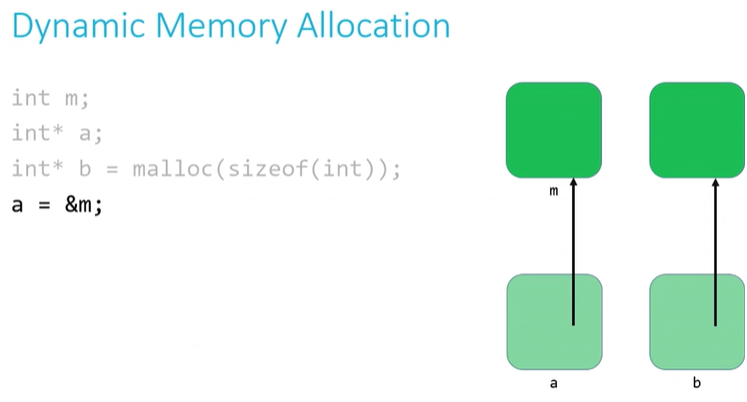
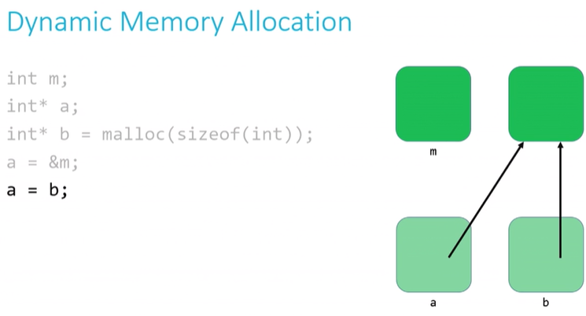
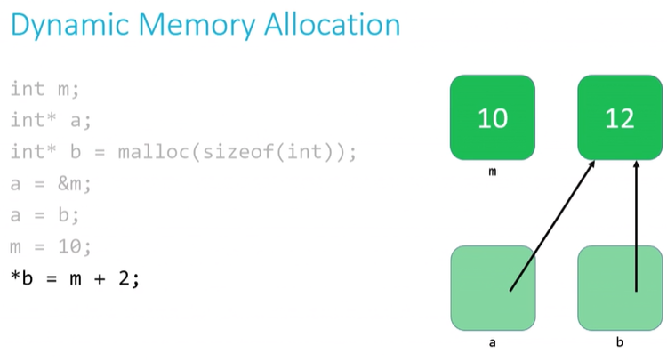
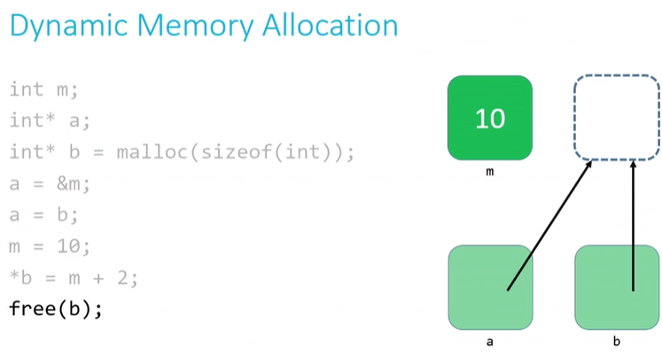

# Week 4 - Shorts

[Pointers](#pointers)  
[Custom data types](#custom-data-types)  
[Dynamic memory allocation](#dynamic-memory-allocation)  
[Call stacks](#call-stacks)

## Pointers

Pointers provide an alternative way to pass data between function. When we pass data to a function with out using pointers, the data gets passed *by value*. This means that the function receives a copy of the data, not the acctual data.

Pointers are data items whose values are just addresses to locations in memory where other variables live. The type of a pointer describes the data type of the value that is stored in that location.

A special pointer is the `NULL` pointer. This pointer points to nothing. Whenever we create a pointer and don't assign it a value, we should have it point to `NULL`. We can check whether the pointer value is `NULL` using the `==` operator.

A different way of creating a pointer is by extracting the address of a variable that already exists. We can do this by using the *address extraction operator*, `&`. This way, if `x` is an `int` variable, `&x` is a pointer-to-int whose value is the address of `x`. Likewise, if `arr` is an array of `double`s, `&arr[i]` is a pointer-to-double, whose value is the address of the i-th element of `arr`. An array's name, then, is acctually just a pointer to its first element.

The main purpose of a pointer is to allow us to modify or inspect the location of which it points. We do this by **dereferencing** the pointer. To dereference a pointer, we use the `*` operator. If we have a pointer-to-char variable called `pc`, `*pc` is the data that lives at the memory address stored inside the variable `pc`. So what the dereference operator does is to *"go to the reference"* and access the data at that memory location, allowing us to manipulate it. If we try to dereference a `NULL` pointer, we'll suffer a **segmentation fault**.

Pointers are best declared in individual lines. But, if we want to declare multiple pointers (say to `int`s) in the same line, we do so by

``` c
int* pa, *pb, *pc;
```

## Custom data types

With the `typedef` keyword we can define new data types or rewrite names for data types. To do se, we define a type in the normal way, and then alias it to something else.

``` c
typedef <old_name> <new_name>;
```

For example, we can use

``` c
typedef char* string;
```

We can also use the `struct` data type to define new complex data types. For example,

``` c
typedef struct car
{
  int year;
  char model[10];
  char plate[7];
  int odometer;
  double engine_size;
}
car_t;
```

## Dynamic memory allocation

We can use pointers to get access to a block of dynamically-allocated memory at runtime. This memory comes from a pool of memory called the `heap` (unlike function calls which are executed in a pool of memory called `stack`).

To get memory at runtime we use the `malloc` function (*memory allocator*). This function takes as a parameter the number of bytes that we are requesting. It will return a pointer to the memory location that it has assigned. If, for some reason, `malloc` can't allocate memory, it will return `NULL`. This is way, after every `malloc` call, we need to check whether the return value was `NULL`. If it was, then we need to terminate the program (it's going to crush anyway if we don't terminate it).

``` c
// statically obtain an integer
int x;
// dunamically obtain an integer
int *px = malloc(sizeof(int));
```

Unlike statically-allocated memory, dynamically-allocated memory is not automatically returned to the system for later use when the function in which it's created finishes execution. We need to explicitly free the memory by calling the `free()` function and pass it the name of the pointer to free-up as an argument. Failing to free the memory results in a **memory leak**.

Do not `free` statically-allocated memory, and only `free` dynamically-allocated memory once!!

As an exmaple

``` c
// Create an integer variable called m in the stack.
int m;
// Create a pointer called a to an integer. The pointer is in the stack.
int* a;
// Create a pointer called b to an integer. 
// Here we've allocated two chunks of memory. One for the pointer and one for the variable it points to.
// The vairable (which does not have a name) is on the heap.
// But the pointer b is on the stack.
int* b = malloc(sizeof(int));
```



``` c
// a gets m's address
// This means that a now points to m
a = &m;
```



``` c
// Changes where a is pointing too (the address it holds)
// a now points to where b points (since b is a pointer itself)
// This is not to be confused with a pointing to b. To do that we use a = &b
a = b;
```



``` c
// Set the value of m to be 10
m = 10;
// Dereference b (*b) with the value of m + 2.
// This means that we are setting the unnamed variable to which b is pointing to, to be 12 (m + 2)
*b = m + 2;
```



``` c
// Release the memory used by the variable to which the pointer b points to
free(b);
```



``` c
// This would cause the variable to which a is pointing to be dereferenced with the value 11.
// But since we've free'd up that memory, it will cause a segmentation fault
*a = 11;
```

## Call stacks

When we call a function a chunk of memory is assigned for that function to do its necessary work. We call these chunks of memory **stack frames** or **function frames**. If it possible that more than one stack frame exists at any given time. This happens when we have functions (such as `main`) that call other functions. Yet, only the frame of the function that is running is active at any given time. These frames are arranged in a stack with the most recently called function at the top of the stack. When a new function is called, a new frame is **pushed** onto the top of the stack and becomes the new active frame. When a function finishes its work, the frame is **popped** off of the stack and the frame immediatly below becomes the active frame and continus its execution from where it left off.


