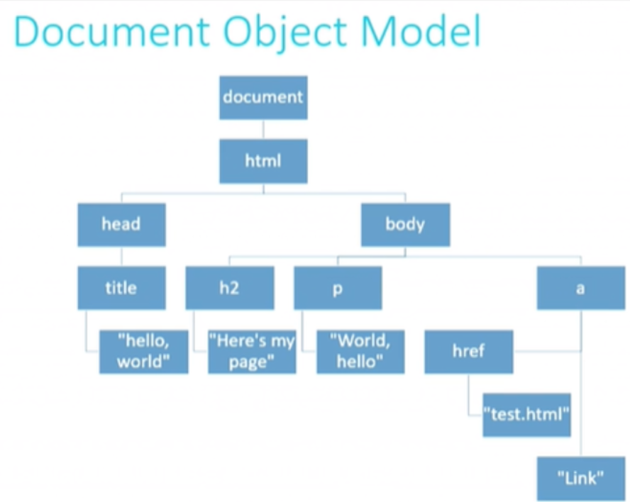

# Week 8 Shorts

[Internet Primer](#internet-primer)  
[IP](#ip)  
[TCP](#tcp)  
[HTTP](#http)  
[HTML](#html)  
[CSS](#css)  
[JavaScript](#javascript)  
[DOM](#dom)  

## Internet Primer

An IP (IPv4) address is a sequence of 32 bits expressed in 4 groupsof decimal numbers: `w.x.y.z` each of them in the 0 to 255 range. This means that there can only be around 4 billion addresses. To solve this issue two things are used. One is to use private addresses. This means that multiple computers can share the same IP, but then the information is internally re-routed. More recently, IPv6 was released which uses 128 bits. There format is the same (groups of 4 decimals, each representing a hex). With this, we can have 340,282,366,920,938,463,463,374,607,431,768,211,456 different addresses (that's 340 undecillion, 282 decillion, 366 nonillion, 920 octillion, 938 septillion, 463 sextillion, 463 quintillion, 374 quadrillion, 607 trillion, 431 billion, 768 million, 211 thousand and 456 different addresses). IPv6 addresses have 8 clusters of 16 bits represented in hex.

`s:t:u:v:w:x:y:z`

When there's a lot of zeros collapsed into double colons: `::`. IP addresses are assigned by a DHCP (Dynamic Host Configuration Protocol). This is just a program that keps track of the addresses that it can assign and assigns them to devices that want to be connected.

**DNS** (Domain Name System) allows us to navigate by using human readable names. It translates names to IP addresses. There are multiple DNSes in the world, each serving their local area. Services like Google collect all the information and aggregate it.

**Access Points** is the network through which we connect to the internet, like your home network. In this scenario, only your home's router has an acctual public IP address that can connect to the internet. The router then assigns a private IP address to each device in your home network. This router is incharged of directing (ie routing) the information comming in and going out of the home network to the WWW.

The internt is just the set of rules (called protocols) that allow all the local networks to communicate between them.

## IP

The Internet Protocol (**IP**) controls how data is transmited between two points. Each network connects to a local **router**. The router contains a routing table that tells it where to go when it sees a specific address. Each router connects a local group of networks or routers to other networks or routers.

Data is separated into small packages. These packages are sent through the network with the data plus the instructions on how to re-assemble all the packages. Not all packages sent from point `A` to point `B` will take the same route.

## TCP

When sending information from point `A` to point `B`, if anything goes wrong along the way, **TCP** (Transmision Control Protocol) is responsible of re-requesting the missing pieces. It also handles transmiting the package to where it needs to go in the machine. TCP achieves this by sending the package to the **port** assigned to the program/utility/service that it's trying to send information to. Some of the ports are so commonly used that they have been standardized in computers:

- FTP (file transfer) uses port 21

- SMTP (e-mail) uses port 25

- DNS uses port 53

- HTTP (web browsing) uses port 80

- HTTPS (secure web browsing) uses port 443

## HTTP

The Hypertext Transfer Protocol, **HTTP**, is an application layer protocol that specifies how the web-page requests must be made from the client to the server, and from the server back to the client. Other protocols include

- **FTP:** File TransferPprotocol for how files are transfered

- **SMTP:** Simple Mail Transfer Protocol for how emails are sent

- **DDS:** Data Distribution Service

- **RPD:** Remote Desktop Protocol for remotly accessing a computer

- **XMPP:** Extensible Message and Presence Protocol for chat services

For example, to request the home page of `cats.com` the client would request

```
GET / HTTP/1.1
Host: cats.com
```

and the server would answer with

```
HTTP/1.1 200 OK
Content-type: text/html
```

where the 200 status code means that all is OK. Other codes exist to signal that things didn't work out as expected. In more general terms, an HTTP request line should inculde

```
method request-target http-version
```

The server will in turn respond with 

```
http-version status
```

Some status code are

| Class        | Code | Text                  | Comments                                       |
|:------------:|:----:|-----------------------|------------------------------------------------|
| Success      | 200  | OK                    | All is well                                    |
| Redirection  | 301  | Moved Permanently     | Page is not at a new location                  |
| Redirection  | 302  | Found                 | Page we temporarily moved                      |
| Client Error | 401  | Unauthorized          | Page requires login credentials                |
| Client Error | 403  | Forbidden             | Server will not allow this request             |
| Client Error | 404  | Not found             | Server can not found what was asked for        |
| Server Error | 500  | Internal Server Error | Generic server failure                         |
| Server Error | 503  | Service unavailable   | Server is currently unable to handle request   |
| Server Error | 504  | Gateway timeout       | Server reached the waiting time for a response |
 
## JavaScript

JS code uses `.js` file extensions. JS code runs on the client side of the application when the user visits the web page. JS code is included in the web page via the `<script>` tag using the `src` attribute.

Iterate over the keys of an object

``` js
for (var key in object)
{
  // use object[key] in here;
}
```

Iterate over the values of an object

``` js
for (var key of object)
{
  // use key in here;
}
```

As an example, suppose we have an array with all the names of the days of the week. Looping over the `day` key with a `for in` will print out the indeces (since there are no keys defined). Looping over the `day` key with a `for in` loop will print out the names of the week.

``` js
var wkArray = ['sunday', 'Monday', 'Tuesday', 'Wednesday', 'Thursday', 'Friday', 'Saturday'];
// Print indeces: 0, 1, ..., 6
for (var day in wkArray)
{
  console.log(day);
}
// Print out day names: Sunday, Monday, ..., Saturday
for (var day of wkArray)
{
  console.log(day);
}
```

An **Event** in JS and HTML is a response to a user doing something on the page (like clicking, or horvering, or loading the page). JS has suppor for **event handlers**, which are *callback functions* that respond to HTML elements. Since everything in JS is an object, so too are events. An event object gets generated when the user's action triggers the event.

Suppose we have the following event handlers

```html
<button onclick="alerrName(event);">Button 1</button>
<button onclick="alerrName(event);">Button 2</button>
```

When the user clicks on either button, the `alertName` function will be called, and the `event` object will be passed to the function. This object contains all the information about what just happened. So, suppose the `alertName` function is as follows

``` js
function alertName(event)
{
  var trigger = event.srcElement;
  alert('You clicked on ' + trigger.innerHTML);
}
```

The variable `trigger` contains the elements source. That is, the HTML element that generated the event. This can be found in the event's object attribute called `srcElement`. We then use the built-in `alert` function to pop-up a message that tells the user that he/she clicked on a button. We used the `innerHTML` attribute of the `trigger` object to get what's inside the HTML tags, in this case, either `Button 1` or `Button 2`.

## DOM

DOM stands for **Document Object Model**. This is a JavaScript object that describes the document. Suppose we have the following HTML page:

``` html
<!DOCTYPE html>
<html>
  <head>
    <title>Hello, world</title>
  </head>
  <body>
    <h2>Here's my page</h2>
    <p>World, hello</p>
    <a href="text.html">Link</a>
  </body>
</html>
```

When the page is loaded, JS will create an object (the DOM) that nests other objects in it, each one of which represents an HTML tag, as shown in the image bellow.



We can now use the methods from the DOM object to modify it and thus change how the site looks like. This is what creates the modern interactive websites. We can inspect the DOM by running `console.dir(document)` in the dev tools. Some of the properties that we can find there are:

| DOM Property | Description                                                    |
|:------------:|----------------------------------------------------------------|
| innerHTML    | Holds the HTML inside a set of HTML tags                       |
| nodeName     | Name of the HTML element or element's attribute                |
| id           | The "id" attribute of an HTML element                          |
| parentNode   | A referece to the node one level up in the DOM                 |
| childNodes   | An array of references to the nodes one level down in the DOM  |
| attributes   | An array of the attributes of an HTML element                  |
| style        | An object encapsulating the CSS/HTML styling of an element     |


The most common methods that we can use to manipulate this properties are


| DOM Method               | Description                                                      |
|:------------------------:|------------------------------------------------------------------|
| getElementById(id)       | Gets the element with a given ID below this point in the DOM     |
| getElementByTagName(tag) | Gets all elements with the given tag below this point in the DOM |
| appendChild(node)        | Add a given node to the DOM below this point                     |
| removeChild(node)        | Remove a specified child node from the DOM                       |


Because DOM manipulation can get quite verbose, we can use a library called **jQuery** to simplify. This library can allow us to simplify all client side scripting (DOM manipulation been just one of those things). For example, if we want change the color of an element with Id `colorDiv` in the document we would have to write the following code in vanilla-JS:

```js
document.getElementById('colorDiv').stryle.backgroundColor = 'green';
```

With jQuery we only write

``` js
$('#colorDiv').css('background-color', 'green');
```
