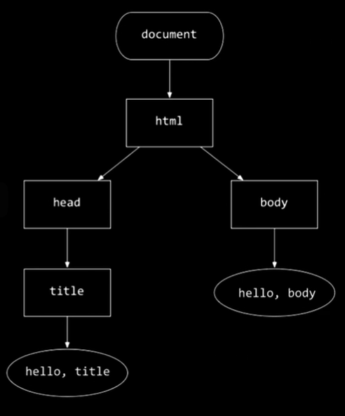

# Week 8 Lecture notes

## What is the internet?

The network of networks. There are computers called **routers** that direct the information from one client to the other and to the servers. Routers use **protocols** that determine how they connect. Two common protcols are **TPC** (Transmition Control Protocol) and **IP** (Internet Protocol).

IP standarize how computers address each other. They provide addresses which are unique to every computer (client or server). Addresses are stored in a **DNS** (Domain Name System). They translate words (like websites domain names) to IP addresses. The DNS service is provided by the **ISP** (Internet Service Provider).

TCP is a standard that tells the server which activity to do. They do so by way of the **TCP Port Number**. This is a small integer that has been stadarized. So, for example, 80 means HTTP and tells the server that it's a webpage. 443 means HTTPS which means the message is a secure request for the webpage. TCP also handles delivery. If the network gets congested, the TCP will handle retrasnmition of the data.

The World Wide Web is just an application that runs on top of the internet. **HTTP/HTTPS** (Hypertext Tranfer Protocol - Secure) governs what information goes inside each package. It comes with commands. Two of them are **GET** (request information from the server) and **POST** ()

**URL**s (Unifrom Resource Locator) are composed by: the protocol (http or https in most cases), host name (for example, www for World Wide Web), the domain (the name of the web page), the top level domain (the type of webpage). After thtat there may come the name of the file. If not mentioned, it'll be `index.html`.

An HTTP request for the default home page might look something like this:

```
GET / HTTP/1.1
Host: www.example.com
```

Or, if it's not looking for the default home page

```
GET /index.html HTTP/1.1
Host: www.example.com
```

The servers response will look like something like this:

```
HTTP/1.1 200 OK
Content-Type: text/html
```

where `200` is the status code, `OK` is a status summary. Other codes mean different things:

- `200`: OK
- `301`: Moved Permanently
- `302`: Found
- `304`: Not Modified
- `307`: Temporary Redirect
- `401`: Unauthorized
- `403`: Forbidden
- `404`: Not Found
- `418`: I'm a Teaport
- `500`: Internal Server Error
- `503`: Service Unavailable

Each line of text inside the request is called a **Header**. We can send requests from the command line using `curl`. If we use the flag `-I` it will only show the Headers form the requests and responses.

``` bash
curl -I http://safetyschool.org
```

We can add other query parameters to the message headers. For example

```
GET /search?q=cats HTTP/1.1
Host: www.google.com
```

will search for cats on Google.

## HTML

Hypertext Markup Language is a markup language used to define the elements that need to be displayed on a webpage. It contains `tags` and `attributes`. The browser will read the content of the HTML top to bottom and left to right and build a tree in the computers memory.



On the CS50 IDE we can run the page with its server by running:

``` bash
http-server 
```

The IDE will use port `8080`.

## CSS

We use Cascading Style Sheets to style the HTML.

